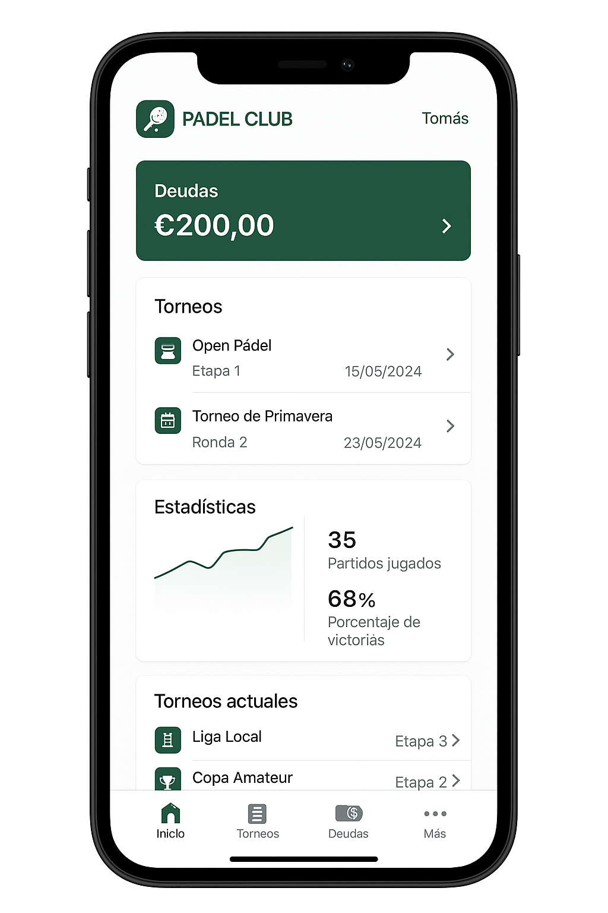

# 🏓 SoftImpulso AR - Padel Club Management

An all-in-one application for managing your padel club, available on **web**, **mobile app**, and **desktop version**.  
Everything your club needs in a single system — modern, secure, and easy to use.

---

## 🚀 Main Features

- 📊 **Complete Admin Panel**  
  Full club control in a simple and intuitive interface.

- 💰 **Debt Manager & Automatic Payments**  
  Track accounts, online payments, and financial control.

- 📅 **Court Booking & Reservations**  
  Manage courts, schedules, fixed and casual bookings.

- 🎾 **Friendly Match Pairing**  
  Smart algorithm to organize matches automatically.

- 🏆 **Tournament Management**  
  - Team registration by pairs  
  - Categories & rankings  
  - Automatic fixture generation  
  - Results management  
  - Upcoming matches display  

- 📈 **Advanced Statistics**  
  Player performance, tournament history, and key metrics.

- 🏋️ **Training & Coaches**  
  Organize classes, track attendance, and manage payments.

- 📲 **Multi-Platform**  
  - **Web**: Accessible from any browser.  
  - **Mobile App**: Available for Android & iOS.  
  - **Desktop**: Optimized version for PC.  

---

## 🖼️ Preview

  
*(Replace this path with your actual image)*

---

## 📧 Contact

For more information, inquiries, or to get the app:  

**Email:** [nicocabanillas2007@gmail.com](mailto:nicocabanillas2007@gmail.com)

---

## ⚡ Built for clubs that want to grow

With **SoftImpulso AR**, your club will always be one step ahead:  
✅ More organized  
✅ More profitable  
✅ More connected with its members
